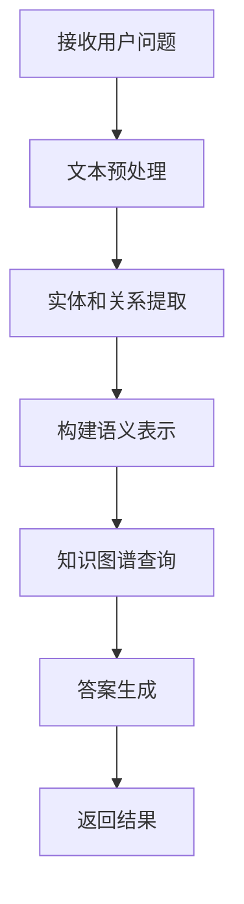
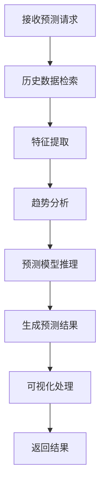

# 知识推理问答系统架构设计

## 1. 系统概述

知识推理问答系统是一个基于知识图谱的智能问答平台，支持内推式问答和外推式预测。系统通过自然语言处理理解用户问题，从知识图谱中检索相关信息，并生成准确的回答或预测结果。

## 2. 系统架构图

```
┌─────────────────┐      ┌─────────────────┐      ┌─────────────────┐
│                 │      │                 │      │                 │
│   Web界面层     │◄────►│  应用逻辑层     │◄────►│  数据存储层     │
│                 │      │                 │      │                 │
└─────────────────┘      └─────────────────┘      └─────────────────┘
```

## 3. 分层设计

### 3.1 Web界面层 (web_interface)

Web界面层负责与用户交互，接收用户输入并展示结果。

**主要组件：**
- **Flask应用**：处理HTTP请求和响应
- **路由控制器**：管理URL路由和视图函数
- **模板渲染引擎**：生成HTML页面
- **静态资源**：CSS、JavaScript和图片等

**核心功能：**
- 用户问题输入界面
- 内推问答结果展示
- 外推预测可视化展示
- 行业趋势图表展示

### 3.2 应用逻辑层

应用逻辑层是系统的核心，包含所有业务逻辑处理。

**主要模块：**

#### 3.2.1 预处理模块 (preprocessing)

```
┌─────────────────┐      ┌─────────────────┐      ┌─────────────────┐
│  文本处理器     │─────►│  AC自动机匹配器  │─────►│  BERT编码器     │
└─────────────────┘      └─────────────────┘      └─────────────────┘
```

- **文本处理器**：使用jieba进行中文分词，清理和规范化文本
- **AC自动机匹配器**：高效识别文本中的实体和关系
- **BERT编码器**：将文本转换为语义向量表示

#### 3.2.2 问答引擎模块 (models)

```
┌─────────────────┐      ┌─────────────────┐      ┌─────────────────┐
│  内推模型       │      │  外推模型       │      │  趋势分析器     │
└─────────────────┘      └─────────────────┘      └─────────────────┘
```

- **内推模型**：在已有知识图谱中查找答案
- **外推模型**：基于现有知识进行预测
- **趋势分析器**：分析行业发展趋势

#### 3.2.3 知识图谱管理器 (knowledge_graph)

```
┌─────────────────┐      ┌─────────────────┐      ┌─────────────────┐
│  图管理器       │─────►│  数据加载器     │─────►│  查询优化器     │
└─────────────────┘      └─────────────────┘      └─────────────────┘
```

- **图管理器**：管理图谱的构建、存储和查询
- **数据加载器**：导入和初始化图谱数据
- **查询优化器**：优化图查询性能

### 3.3 数据存储层

数据存储层负责数据的持久化存储和快速检索。

**主要组件：**
- **Neo4j数据库**：存储知识图谱数据
- **文件系统**：存储模型文件和配置文件
- **缓存系统**：优化频繁查询的响应速度

## 4. 核心流程图

### 4.1 内推问答流程



### 4.2 外推预测流程



## 5. 模块交互设计

### 5.1 数据流

1. **输入处理流程**：用户问题 → 预处理模块 → 特征表示
2. **查询执行流程**：特征表示 → 问答引擎 → 知识图谱查询
3. **结果生成流程**：查询结果 → 答案生成 → 可视化 → 用户界面

### 5.2 组件依赖关系

- **Web界面** 依赖 **问答引擎** 和 **知识图谱管理器**
- **问答引擎** 依赖 **预处理模块** 和 **知识图谱管理器**
- **预处理模块** 依赖 **文本处理工具** 和 **机器学习模型**
- **知识图谱管理器** 依赖 **Neo4j数据库**

## 6. 技术选型

### 6.1 编程语言
- **Python 3.8+**：主要开发语言

### 6.2 Web技术
- **Flask**：Web框架
- **Jinja2**：模板引擎
- **Bootstrap**：前端UI框架
- **Chart.js**：数据可视化

### 6.3 自然语言处理
- **jieba**：中文分词
- **Transformers (BERT)**：语义理解
- **pyahocorasick**：高效字符串匹配

### 6.4 知识图谱
- **Neo4j**：图数据库

### 6.5 机器学习
- **PyTorch**：深度学习框架
- **scikit-learn**：机器学习工具
- **NumPy/Pandas**：数据处理

## 7. 扩展性设计

### 7.1 模块化设计
- 各功能模块松耦合，便于独立开发和测试
- 清晰的API接口定义，支持模块替换

### 7.2 插件系统
- 支持新的实体识别和关系提取算法
- 支持自定义的问答策略

### 7.3 水平扩展
- 支持多实例部署
- 支持负载均衡

## 8. 性能优化

### 8.1 查询优化
- 图查询索引优化
- 缓存常用查询结果

### 8.2 计算优化
- 模型推理加速
- 批量处理机制

### 8.3 存储优化
- 数据压缩策略
- 冷热数据分离

## 9. 安全设计

### 9.1 认证与授权
- 用户身份验证
- 访问权限控制

### 9.2 数据安全
- 敏感数据加密
- 数据备份与恢复

### 9.3 防护措施
- SQL注入防护
- XSS攻击防护
- 速率限制

## 10. 部署架构

### 10.1 开发环境
- 本地开发服务器
- Docker容器化部署

### 10.2 生产环境
- 负载均衡器
- 应用服务器集群
- 数据库集群
- 监控系统

## 11. 未来架构演进

### 11.1 微服务架构
- 将单体应用拆分为微服务
- 使用消息队列实现服务间通信

### 11.2 实时处理能力
- 引入流处理框架
- 支持实时知识更新

### 11.3 多模态支持
- 集成图像、语音等多模态数据
- 提供多模态输入输出能力